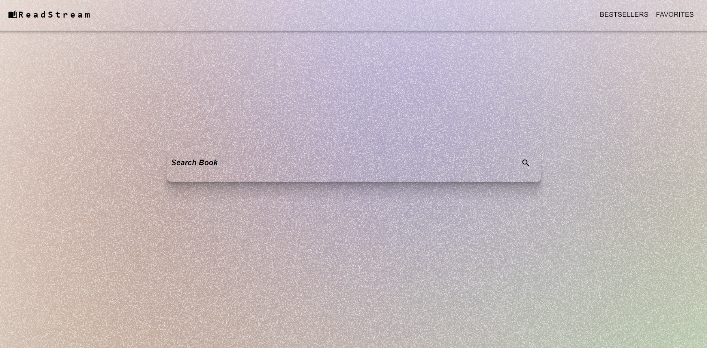
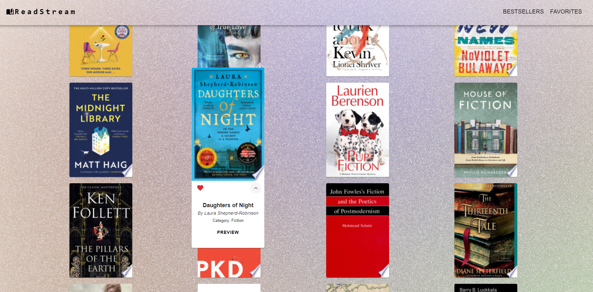
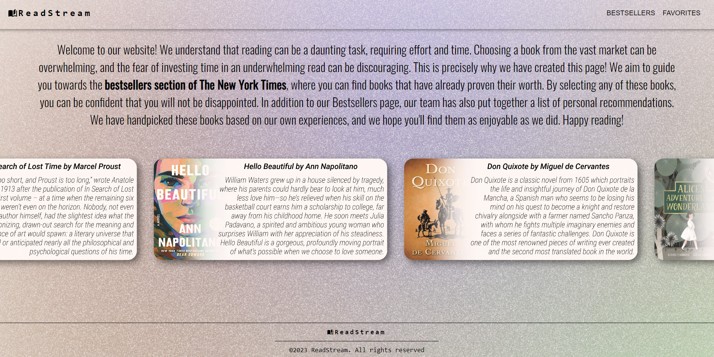
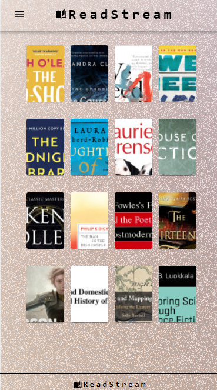

# ReadStream

## Description

ReadStream is an application designed to provide users with an easy and \
convenient way to find books to read. 
The app offers a vast selection of \
books from various genres. Users are able to read more about the bestsellers \
and also save their favourite books, which they can then refer to.
## Installation

Clone this repository to your local machine.\
Run the `npm install` and `the npm` start commands within the project directory.\
Open [http://localhost:3000](http://localhost:3000) to view the app in your browser.\
The page will reload when you make changes.

## Usage

To make edits to the components, navigate to the `src/components` folder.

## Screenshots

## Future Development

* Adding a book genre filter
* Adding a user portal where users can track their reading progress
* Implementing a book recommendation system

## Contributors

* Mateus De Oliveira
* Маriia Kiriakulova
* Codrina Pal

## License

Please refer to the LICENSE in the repo.